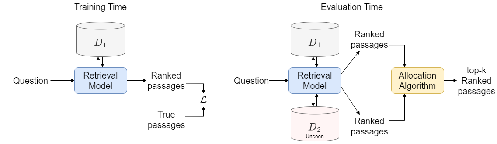

# Resources and Evaluations for Multi-Distribution Dense Information Retrieval

This repository contains code for our [paper](http://arxiv.org/abs/2306.12601).

***Overview*** We study the underexplored problem of multi-distribution information retrieval (IR) where given a query, systems need to retrieve passages from within multiple collections, each drawn from a different distribution. Some of these collections and distributions might not be available at training time. To evaluate methods or multi-distribution retrieval, we design three benchmarks for this task from existing single-distribution datasets, namely, a dataset based on question answering and two based on entity matching. We explore simple methods to improve quality on this task which allocate the fixed retrieval budget (top-k passages) strategically across domains. We hope these resources facilitate futher exploration!

<p align="center"></p>

### Obtaining the datasets

Coming soon.

### Running the experiments

Coming soon.

### Citations

If you use this codebase, or otherwise found our work valuable, please cite:
```
@article{chatterjee2023retrieval,
  title={Resources and Evaluations for Multi-Distribution Dense Information Retrieval},
  author={Chatterjee, Soumya and Khattab, Omar and Arora, Simran},
  journal={Proceedings of the 2023 ACM SIGIR Workshop on Retrieval-Enhanced Machine Learning (REML ’23)},
  year={2023}
}
```

As well as the original creators of the datasets you use:

***ConcurrentQA***
```
@article{arora2023reasoning,
    title={Reasoning over Public and Private Data in Retrieval-Based Systems}, 
    author={Simran Arora and Patrick Lewis and Angela Fan and Jacob Kahn and Christopher Ré},
    year={2023},
    journal={Transactions of Computational Linguistics (TACL '23)},
}
```

***Walmart-Amazon***
```
@misc{magellandata,
    title={The Magellan Data Repository},
    howpublished={\url{https://sites.google.com/site/anhaidgroup/projects/data}},
    author = {Das, Sanjib and Doan, AnHai and G. C., Paul Suganthan and Gokhale, Chaitanya and Konda, Pradap and Govind, Yash and Paulsen, Derek},
    institution={University of Wisconsin-Madison},
    year = {2017}
}
```

***Amazon-Google***
```
@article{kopcke2010evaluation,
  title={Evaluation of entity resolution approaches on real-world match problems},
  author={K{\"o}pcke, Hanna and Thor, Andreas and Rahm, Erhard},
  journal={Proceedings of the VLDB Endowment},
  volume={3},
  number={1-2},
  pages={484--493},
  year={2010},
  publisher={VLDB Endowment}
}
```
